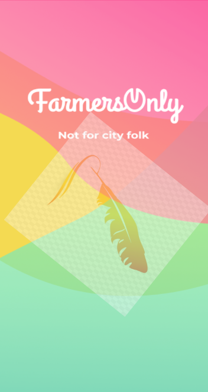
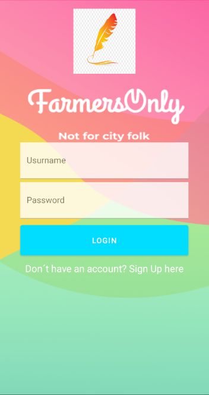
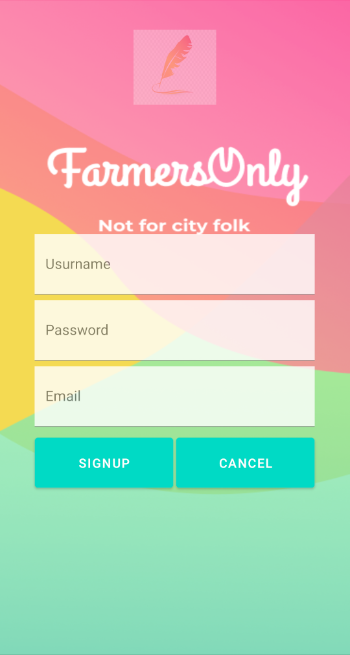
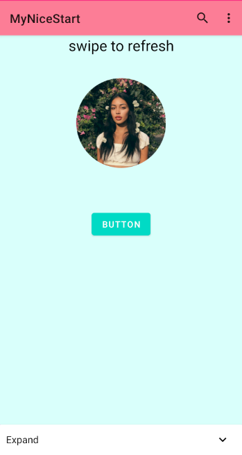
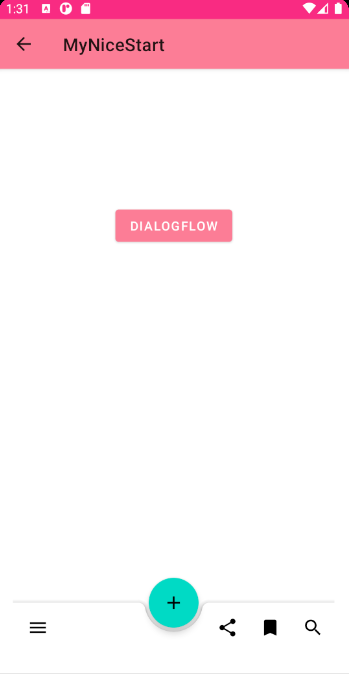
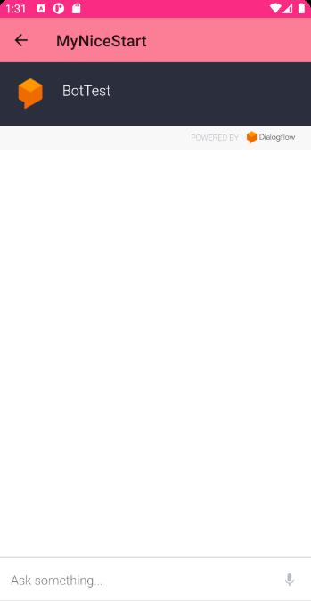

# MyNiceStart
FarmersOnly es una apliacion dirigida a granjeros para ayudarles a encontrar amor:
[GitHub My Nice Start](https://github.com/Sarlekos/NiceStart)

Estas son las pantallas con sus interfaces que encontraras en la aplicacion: 

El 'SplashScreen' usa una animacion con el logo de la aplicacion y te lleva a la pantalla de login. 
En la pantalla de 'Login' podras haceder al main desde el boton del login o hacer click en el texto para llevarte a 'Register' 
En 'Register' podras registrar tu cuenta, cuando haces click en crear te lleva al main, si haces click en cancelar de lleva de vuelta al login. 
En 'Main' hay varios componentes, los cuales son: AppBar,Menú Contextual,Alert Dialog,SwipeRefreshLayout con SnackBar,Expandable Cardview 
En 'Main2' esta componente BottomBar y un boton que te lleva al 'DialogFLow' 
La pantalla de 'DialogFLow' contiene un chat bot.

SplashScreen | LogIn | Register | Main | Main2 | DialogFlow
------ | ------ | ------ | ------ | ------ | ------
 |  |  |  |  | 

